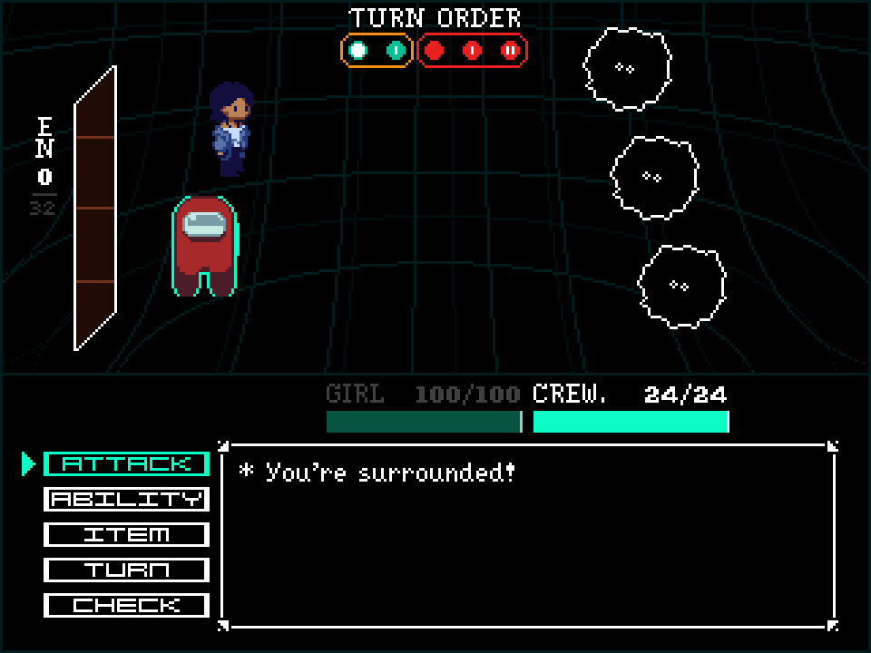
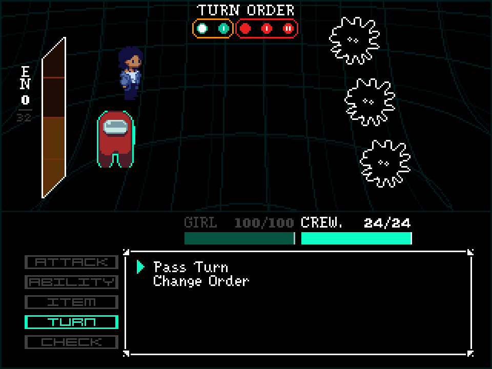
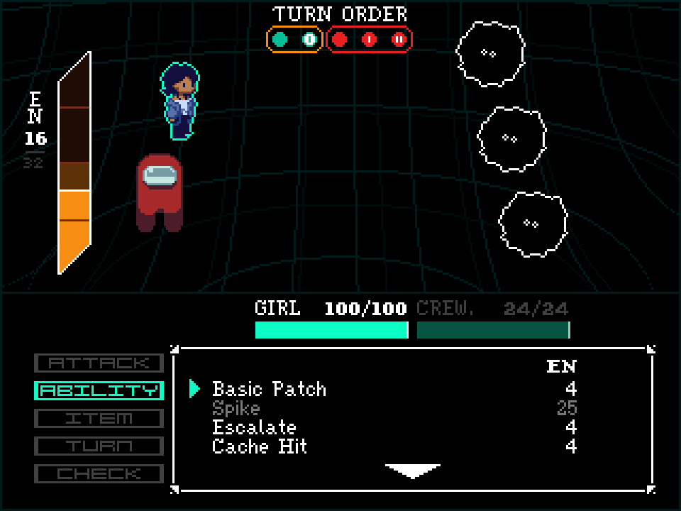
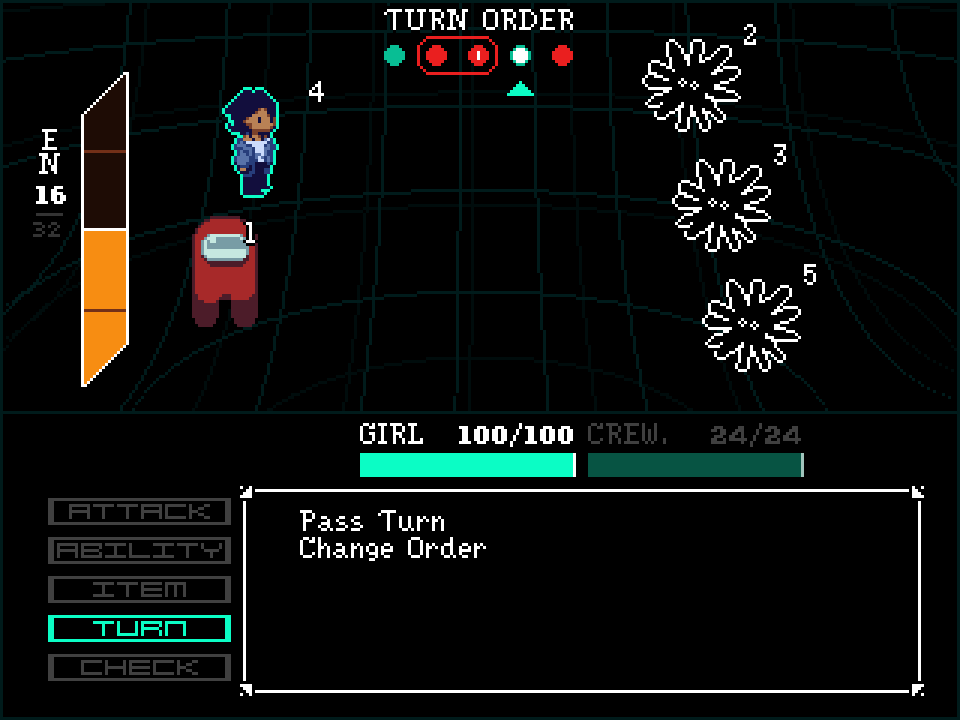
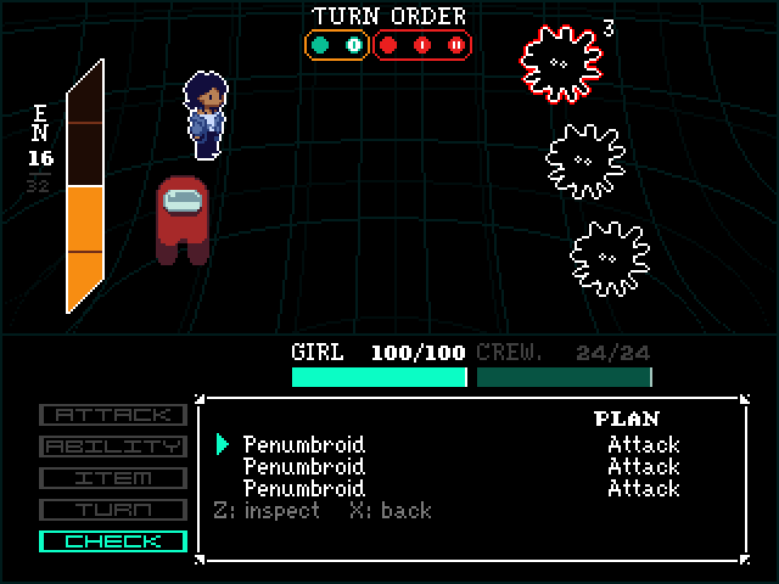
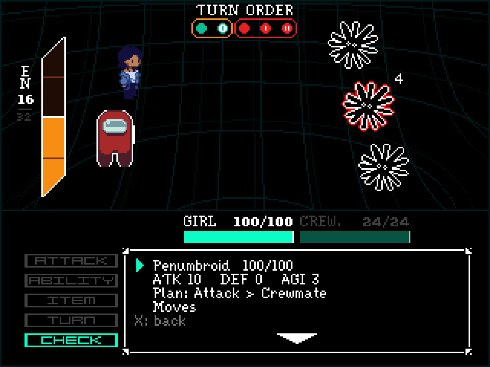
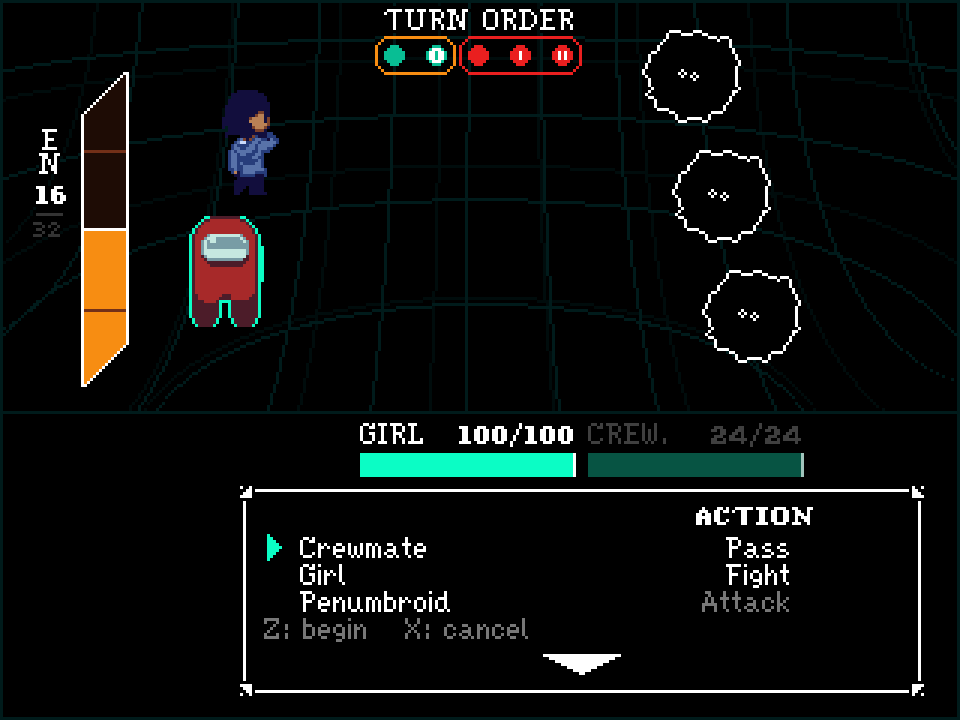

# Battle UI

Each round puts the party and the enemies into one shared track. Agility sets the order. If one
side takes two or more turns in sequence, those turns make a Link. Each step in a Link adds 25%
damage. You select an action for every party member before the round starts. You can also move
your own turns to different positions in the track.

EN is the resource that pays for abilities. Each battle starts at 0 EN. The maximum is 32.

## How to read the turn track

The turn track is at the top right of the screen. The track shows one bubble for each combatant,
from left to right, in the order that the turns occur. Cyan bubbles are your party. Red bubbles
are the enemies.

A Link panel goes around each group of two or more turns from the same side. The panel is gold
for the party and red for the enemies. In a Link, each bubble after the first shows a Roman
numeral. The numeral gives the damage step. I is +25%, II is +50%, and the maximum is V.

Each bubble is 7 by 7 pixels. There is no space for a text label, so the interface uses a
numeral instead.

All screenshots come from the running game.

## Round start

The turn track shows two party members in a gold Link panel and three enemies in a red Link
panel. The health of each party member is above the text box. The EN meter at the far left
shows 0 of 32.

## Pass turn

The player selected TURN, and then Pass Turn. The EN meter shows a preview of the increase
while the option is highlighted. A pass gives 16 EN immediately. The party does not wait for
the turn to occur.

## Abilities

The screenshot shows the ability list for Girl. Crewmate passed before Girl, so the EN meter
now shows 16. Spike has a cost of 25 EN. The game shows Spike in grey because Girl cannot pay
that cost. The other abilities have a cost of 4 EN.

## Change order

Girl moved two positions later in the track. The party no longer has a Link, and the enemy
group of three is now a group of two plus a single turn. The game also shows the position of
each combatant next to that combatant on the battlefield.

## Check

The enemies select their actions before you select yours. The PLAN column shows the action of
each enemy. Check does not use a turn. When you exit Check, the menu returns to the same
position.

## Check selection

When you move down the list, the game puts a red outline on the selected enemy. The game also
puts a white outline on the target of that enemy. The number next to the enemy gives the
position of that enemy in the round.

## Check readout

The readout shows the health of the enemy and the attack, defense and agility values. The
readout also gives the action that the enemy selected, the target of that action, and the list
of moves.

## Confirm

The confirm screen is the last screen before the round starts. The screen shows the action of
each party member and each enemy, in the order that the turns occur. The enemy rows are grey.

---

Godot 4.7. GDScript.
